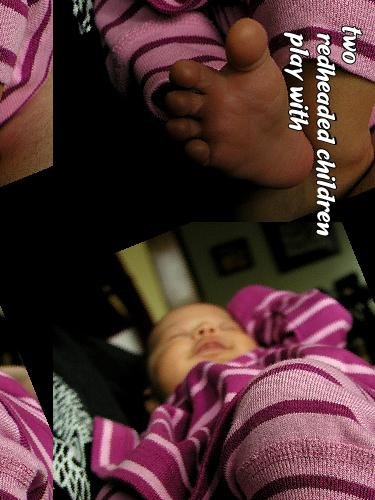
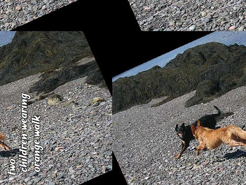
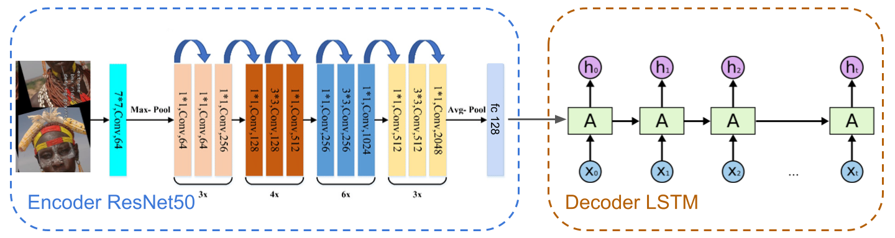

# Caption Reader

An encoder-decoder model for reading noisy captions from images. Given a dataset having English captions embedded in the images themselves, the task is to extract these captions. The dataset consists of 50,000 such images for training and 5000 similar images for testing. A few sample images from the dataset are shown below.

<p align="center">
     
     
     
     
</p>

A more detailed description can be found in the problem statement [here](./ass4.pdf).

### Architecture

The main model architecture consists of an encoder that is a ResNet 50 backbone. ResNet 50 is a convolutional neural network that is 50 layers deep, with multiple convolutional and residual blocks added alternatingly. A generic resnet architecture is implemented that works for some input image, and generates a feature vector of a given dimension. For the encoder, an embedding dimension of 128 is used.

The LSTM module provided by pytorch is directly used for the decoder. The embeddings are extracted from the captions, concatenatenated with the features of the image given by the encoder and the embeddings of the caption, and passed through the LSTM module. Finally, a fully connected layer is applied on the LSTM outputs and used as the predictions for the decoder. A brief description of the architecture can be seen in the figure below.

<p align="center">
     
</p>


### Instructions to run

To train the model on a given dataset, run

```
python3 train.py --root <root_path> --ann <annotation_path> --epoch <no_epochs>
```

To use the Imagenet pretrained resnet50 model for the encoder, simply add a `--comp` argument to the command above.

To run inference and dump predictions on a test dataset, run


```
python3 predict.py --root ../test_data --ckpt_path 24_ll/model_10.pth --save test_out.tsv --mode dump
```

Further details regarding other arguments and options can be seen by running `python3 predict.py --help` and `python3 train.py --help`.